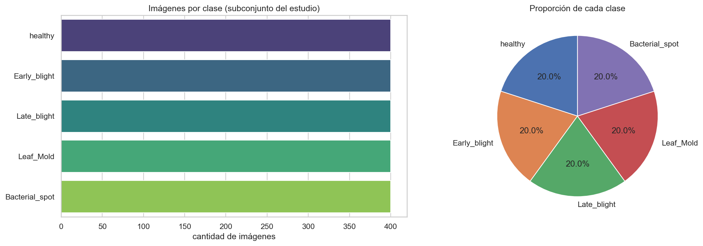
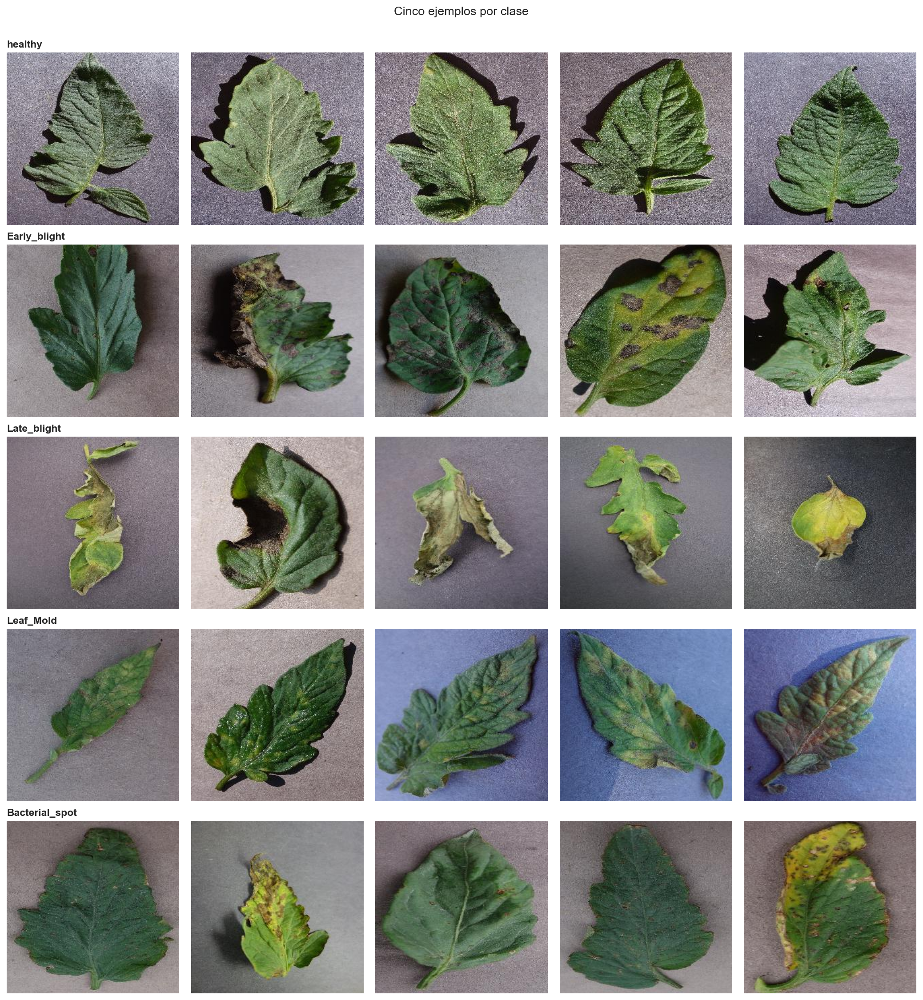
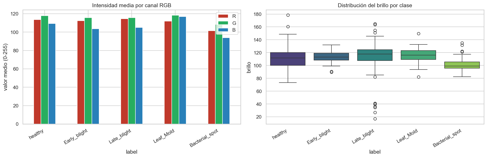
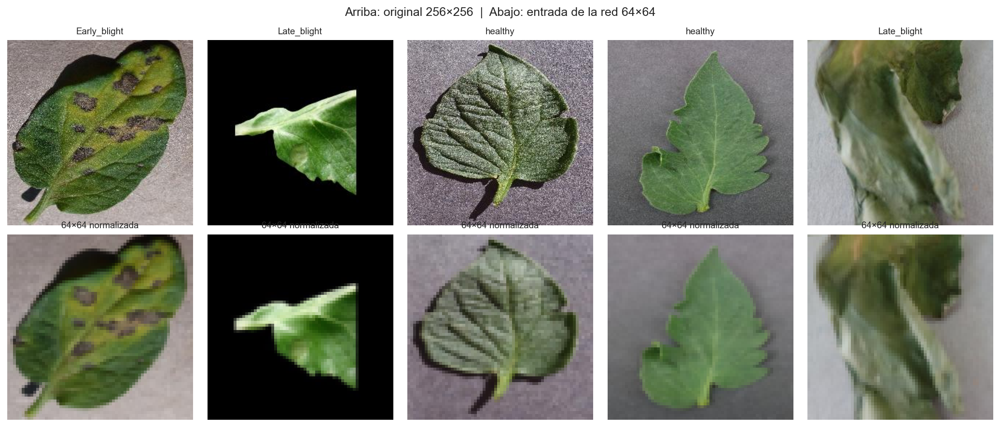

# Informe técnico — Clasificación de enfermedades en hojas de tomate con un MLP

**Asignatura:** TLY1102 — Técnicas Avanzadas de Machine Learning I
**Evaluación:** Parcial N°1 — Presentación y defensa técnica del proyecto
**Notebook asociado:** [`notebooks/plantvillage_mlp.ipynb`](notebooks/plantvillage_mlp.ipynb)

Este documento resume, en formato README, el desarrollo del proyecto siguiendo
la metodología CRISP-DM. El detalle de código, gráficos y salidas de ejecución
está en el notebook; aquí se documentan las decisiones y su justificación.

---

## 1. Descripción del problema de negocio

El tomate es uno de los cultivos de mayor valor comercial y también uno de los
más vulnerables a enfermedades foliares. El diagnóstico en campo depende hoy de
la inspección visual de un agrónomo: es lento, no escala a cientos de hectáreas
y su precisión varía según la experiencia de quien revisa. Cuando una infección
como el *tizón tardío* se detecta tarde, puede arrasar un cultivo completo en
pocos días.

**Oportunidad:** si una fotografía tomada con un teléfono permite reconocer la
enfermedad, el productor puede priorizar qué sectores inspeccionar y aplicar
tratamiento dirigido en lugar de fumigar todo el campo por precaución.

**Problema de clasificación:** dada la imagen de una hoja de tomate, asignarla a
una de cinco categorías —una sana y cuatro enfermedades— mediante un modelo de
clasificación supervisada multiclase.

| Clase | Naturaleza | Señal visual característica |
|-------|-----------|------------------------------|
| `Tomato_healthy` | Sana | Hoja verde uniforme, sin lesiones |
| `Tomato_Early_blight` | Hongo | Manchas concéntricas tipo diana |
| `Tomato_Late_blight` | Hongo | Lesiones irregulares café con halo pálido |
| `Tomato_Leaf_Mold` | Hongo | Manchas amarillas difusas en el haz |
| `Tomato_Bacterial_spot` | Bacteria | Puntos pequeños, oscuros y numerosos |

---

## 2. Objetivos del proyecto

**Objetivo general:** construir y evaluar críticamente un **Perceptrón
Multicapa (MLP)** que sirva de *modelo base* para esta tarea, documentando el
flujo completo de aprendizaje supervisado e identificando las limitaciones
estructurales del MLP frente a imágenes — el fundamento para justificar, en la
siguiente unidad, el paso a arquitecturas convolucionales.

> El objetivo **no** es maximizar el accuracy. Es comprender el flujo de
> trabajo y argumentar técnicamente cada decisión.

**Objetivos específicos:**

1. Caracterizar el subconjunto de datos y verificar su calidad (EDA).
2. Preprocesar las imágenes de forma coherente con la entrada que exige un MLP.
3. Diseñar una arquitectura MLP justificando capas, activaciones e
   hiperparámetros.
4. Entrenar con validación y diagnosticar convergencia, overfitting y
   underfitting.
5. Evaluar con Accuracy, Precision, Recall, F1 y matriz de confusión.
6. Auditar los errores e identificar qué clases se confunden y por qué.

---

## 3. Definición de KPIs

Se distingue entre la métrica que guía el entrenamiento y los indicadores que
responden a la pregunta de negocio.

| KPI | Definición | Meta | Por qué este umbral |
|-----|-----------|------|---------------------|
| **Accuracy (test)** | % de hojas bien clasificadas | ≥ 60 % | Un clasificador al azar entre 5 clases balanceadas acierta 20 %; triplicar ese valor demuestra que la red aprendió señal real |
| **F1-score macro** | Media armónica de precision y recall, promediada por clase | ≥ 60 % | Promedia por clase sin ponderar por frecuencia: una clase ignorada por el modelo hunde el indicador aunque el accuracy se vea bien |
| **Recall de clases enfermas** | Enfermas detectadas sobre enfermas reales | ≥ 60 % | Un falso negativo (enferma clasificada como sana) es el error costoso: la planta queda sin tratamiento y contagia al resto |
| **Brecha de generalización** | Accuracy de entrenamiento − accuracy de prueba | ≤ 0,15 | Mide memorización; una brecha amplia indica que el modelo no sirve con hojas nuevas |

**Por qué el recall pesa más que la precision en este problema:** un falso
positivo hace que el agrónomo revise una planta sana — cuesta unos minutos. Un
falso negativo deja una planta enferma sin tratar y sigue contagiando. Los dos
errores no son simétricos, y por eso el recall de enfermas se reporta como KPI
separado del accuracy global.

**Resultado obtenido** (detalle completo en el notebook, sección 6):

| KPI | Meta | Obtenido | Cumple |
|-----|------|----------|--------|
| Accuracy (test) | ≥ 0,60 | 0,8233 | ✅ |
| F1-score macro | ≥ 0,60 | 0,8192 | ✅ |
| Recall clases enfermas | ≥ 0,60 | 0,7792 | ✅ |
| Brecha de generalización | ≤ 0,15 | 0,1481 | ✅ |

---

## 4. Descripción de las fuentes de datos

**PlantVillage** es un conjunto público de hojas de cultivo fotografiadas en
laboratorio sobre fondo uniforme, con etiqueta verificada por especialistas.

| Atributo | Valor |
|----------|-------|
| Origen | Kaggle — [`emmarex/plantdisease`](https://www.kaggle.com/datasets/emmarex/plantdisease) |
| Volumen total | > 20.000 imágenes, 15 clases (pimiento, papa, tomate) |
| Formato | JPG, RGB (3 canales), 256 × 256 px |
| Etiqueta | Carpeta contenedora (una por clase) |
| Licencia | Uso público para investigación |

**Por qué este dataset:** está etiquetado y balanceado, tiene volumen
suficiente para entrenar sin depender de aumento de datos externo, y su señal
visual es de textura y color — justamente el tipo de patrón que permite mostrar
dónde un MLP alcanza su techo.

### Variante del grupo

Para diferenciar el trabajo de otros grupos se fijaron estas decisiones,
reproducibles con una única semilla:

- **5 clases** del cultivo tomate (no las 38 del dataset completo).
- **400 imágenes por clase** como máximo → 2.000 imágenes en total, muestreadas
  al azar.
- **Semilla 1102** en todo el proceso (muestreo, particiones, inicialización de
  pesos).
- **Resolución 64 × 64 px** en RGB → 12.288 valores de entrada por imagen.
- **Partición estratificada 70 / 15 / 15** en entrenamiento, validación y
  prueba.

El dataset no se incluye en el repositorio por su tamaño (ver
[README.md](README.md) para instrucciones de descarga y montaje).

---

## 5. Preparación y análisis exploratorio de los datos (EDA)

### 5.1 Distribución de clases

El muestreo con tope de 400 imágenes por clase dejó las cinco clases con el
mismo número de imágenes: el conjunto quedó **perfectamente balanceado**. Dos
consecuencias prácticas: el accuracy es interpretable (no puede inflarse
prediciendo siempre la clase mayoritaria, porque no hay clase mayoritaria) y la
línea base al azar es 20 % (1/5).

### 5.2 Control de calidad

Se verificó que las imágenes seleccionadas no tuvieran archivos corruptos,
resoluciones inconsistentes ni modos de color distintos de RGB. El resultado:
**cero imágenes corruptas**, todas RGB, todas 256 × 256 px. No se requirió
imputación ni descarte de registros — consecuencia de que PlantVillage se
construyó en laboratorio con protocolo fijo.

### 5.3 Exploración visual

### 5.4 Color promedio por clase

Un MLP sobre píxeles planos no detecta formas; lo único que puede aprovechar
son diferencias globales de color e intensidad. Se midió cuánta señal hay ahí,
como insumo para anticipar qué clases confundiría el modelo.

**Lectura:** las clases **no** se separan de forma homogénea por color global.

- `Bacterial_spot` y `Leaf_Mold` tienen una firma de color propia: la primera es
  notablemente más oscura, la segunda destaca en el canal azul.
- `Early_blight` y `Late_blight` tienen el perfil de color **más parecido entre
  sí** de las cinco clases — ambas son hongos que producen lesiones café sobre
  tejido verde, y lo que las distingue es la *forma* de la lesión, no el color.
- `healthy` no tiene lesión que le dé firma de color propia; su rasgo
  distintivo es la ausencia de textura anómala, una propiedad que este gráfico
  no permite anticipar.

**Predicción verificable planteada en el EDA:** el par `Early_blight`/
`Late_blight` debería confundirse más entre sí, y `Bacterial_spot`/`Leaf_Mold`
deberían clasificarse mejor por tener firma propia. Esta predicción se contrasta
con los resultados reales en la sección 7 del notebook: **se cumplió para las
cuatro clases con lesión**, y `healthy` resultó ser la mejor clasificada gracias
al aumento de datos (ver sección 7.5 del notebook para el detalle completo).

### 5.5 Preprocesamiento aplicado

1. **Redimensionar a 64 × 64.** A 256 × 256 × 3 la primera capa densa tendría
   más de 50 millones de parámetros frente a 1.400 imágenes de entrenamiento —
   imposible de entrenar sin memorizar. A 64 × 64 × 3 quedan 12.288 entradas: se
   pierde detalle fino, pero el modelo vuelve a ser entrenable.
2. **Normalizar a [0, 1]** dividiendo por 255. Con valores 0–255 las sumas
   ponderadas iniciales son enormes y el entrenamiento puede no converger.
3. **Partición estratificada 70/15/15** antes de cualquier ajuste, para evitar
   fuga de datos (*data leakage*). `stratify` mantiene la proporción de las
   cinco clases en cada subconjunto.
4. **`Flatten()`** al inicio de la red: convierte la matriz 64×64×3 en un
   vector de 12.288 valores porque una capa `Dense` solo acepta vectores. Aquí
   se pierde la estructura espacial — el costo conceptual central de usar un
   MLP en imágenes (ver sección 4 y 7 del notebook).

---

## 6. Metodología utilizada (CRISP-DM)

| Fase CRISP-DM | Dónde se resuelve |
|---------------|-------------------|
| **Comprensión del negocio** | Secciones 1-3 de este informe (problema, objetivos, KPIs) |
| **Comprensión de los datos** | Sección 4-5 de este informe / sección 2 del notebook (inventario, calidad, EDA) |
| **Preparación de los datos** | Sección 5.5 de este informe / sección 3 del notebook (partición, normalización) |
| **Modelado** | Sección 4 del notebook (arquitectura MLP) y sección 5 (entrenamiento + barridos comparativos) |
| **Evaluación** | Secciones 6 y 7 del notebook (métricas, matriz de confusión, análisis de errores) |
| **Despliegue** | Fuera del alcance de esta evaluación; se discute como trabajo futuro en la sección 8 del notebook |

---

## 7. Resumen de resultados

*(Sección complementaria — el detalle completo, con gráficos e interpretación
línea por línea, está en las secciones 4 a 8 del notebook.)*

**Arquitectura:** `Flatten → Dense(256) → Dense(128) → Dense(5, softmax)`, con
BatchNormalization, Dropout(0,3), regularización L2 y aumento de datos
(espejo horizontal + rotación ±5°) en el entrenamiento.

| Aspecto | Valor |
|---------|-------|
| Parámetros totales | 3.181.061 (≈ 99 % en la primera capa densa) |
| Optimizador | Adam (lr inicial = 0,001) + ReduceLROnPlateau |
| Función de pérdida | `sparse_categorical_crossentropy` |
| Épocas ejecutadas | 60 (tope alcanzado; se conservaron los pesos de la época 53, la de menor `val_loss`) |
| Accuracy en prueba | 82,33 % |
| F1-score macro | 81,92 % |

**Principal hallazgo de la auditoría de errores:** el aumento de datos mejoró
todas las métricas promedio respecto de un modelo sin aumento (68,67 % de
accuracy), pero también desplazó una pequeña fracción del error hacia el tipo
más costoso — 6 de 240 hojas enfermas fueron clasificadas como sanas, cuando el
modelo sin aumento de datos no cometía ese error. El recall de clases enfermas
(77,9 %) sigue cumpliendo la meta, pero el hallazgo confirma que mejorar el
promedio no garantiza mejorar la métrica que más importa para el negocio — la
razón por la que ambas cifras se reportan por separado en la sección 3.

**Limitación central identificada:** el `Flatten()` inicial destruye la
vecindad entre píxeles, y con ella la noción de "anillo concéntrico" o "mancha
irregular". El MLP resuelve bien lo que se puede resolver con estadísticos
globales de color (`Bacterial_spot`, `Leaf_Mold`) y falla donde hace falta
interpretar la forma de la lesión (`Early_blight` ↔ `Late_blight`). Esta
limitación es arquitectónica, no de entrenamiento: el barrido de la sección 5
del notebook muestra que multiplicar por ~8 los parámetros de la red apenas
mueve la validación, mientras que la tasa de aprendizaje —un eje ajeno a la
capacidad— produce diferencias de un orden de magnitud mayor. Si el techo se
pudiera levantar agregando neuronas, ahí se habría visto. Es la justificación
empírica para adoptar una red convolucional en la siguiente unidad.

---

## Referencias

- Dataset: Kaggle — [`emmarex/plantdisease`](https://www.kaggle.com/datasets/emmarex/plantdisease) (PlantVillage)
- Notebook completo: [`notebooks/plantvillage_mlp.ipynb`](notebooks/plantvillage_mlp.ipynb)
- Estructura del proyecto y ejecución: [`README.md`](README.md)
